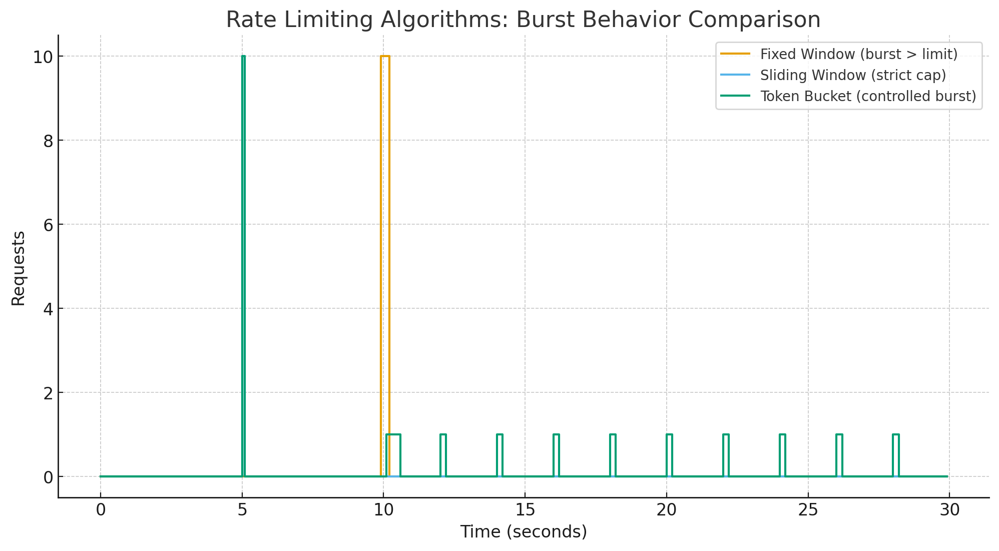

# API Gateway with Rate Limiting

This project is an example of an API Gateway implemented in Node.js with Express and TypeScript. It includes four different rate-limiting algorithms.

## Rate Limiting Algorithms

This project demonstrates the following rate-limiting algorithms:

1.  [Fixed Window](#fixed-window)
2.  [Sliding Window](#sliding-window)
3.  [Token Bucket](#token-bucket)
4.  [Leaky Bucket](#leaky-bucket)

---

## Comparison Table

| Algorithm | Pros | Cons | Burst Handling | Memory Cost | Time Complexity |
| :--- | :--- | :--- | :--- | :--- | :--- |
| **Fixed Window** | Simple, low computation cost. | Can allow double the rate at window edges. | Poor | Low (single counter per user) | O(1) |
| **Sliding Window** | Accurate rate limiting. | Memory-intensive, can be slow. | Good, but can be resource-intensive. | High (stores all timestamps) | O(N) |
| **Token Bucket** | Handles bursts, memory-efficient. | Can be complex, allows "leaky" bursts. | Excellent, allows configurable bursts. | Low (stores tokens and last refill time) | O(1) |
| **Leaky Bucket** | Smooths traffic, predictable. | No bursts allowed. | Poor (no bursts allowed) | Low (stores queue size and last leak time) | O(1) |

---

## Algorithm Comparison

### Fixed Window

**Methodology:**
The Fixed Window algorithm divides time into fixed-size intervals (windows) and assigns a counter to each window. Each incoming request increments the counter for the current window. If the counter exceeds a threshold, further requests are rejected until the next window starts, at which point the counter is reset.

**Pros & Cons:**
*   **Pros:** It is simple to implement and computationally cheap.
*   **Cons:** A burst of traffic at the edge of a window can cause a flood of requests in the next window, exceeding the rate limit. For example, if the limit is 5 requests per minute, a user could make 5 requests at 0:59 and another 5 at 1:01, effectively making 10 requests in a 2-second interval.

**Burst Handling:**
This algorithm does not handle bursts well. It can allow twice the number of allowed requests in a short period.

**Code:**
```typescript
import { Request, Response, NextFunction } from "express";

interface ClientRecord {
  count: number;
  windowStart: number;
}

const clients = new Map<string, ClientRecord>();

const WINDOW_SIZE_IN_MS = 60000; // 1 minute
const MAX_REQUESTS_PER_WINDOW = 5; // max 5 requests per window

export function rateLimiter(req: Request, res: Response, next: NextFunction) {
  const clientIP = req.header("X-Client-ID") || req.ip;

  if (!clientIP) {
    return res.status(400).json({ error: "Unable to determine client IP" });
  }

  const currentTime = Date.now();
  const record = clients.get(clientIP);

  if (!record) {
    clients.set(clientIP, { count: 1, windowStart: currentTime });
    return next();
  }

  if (currentTime - record.windowStart > WINDOW_SIZE_IN_MS) {
    record.count = 1;
    record.windowStart = currentTime;
    clients.set(clientIP, record);
    return next();
  }
  if (record.count < MAX_REQUESTS_PER_WINDOW) {
    record.count++;
    clients.set(clientIP, record);
    return next();
  }
  return res.status(429).json({ error: "Rate limit exceeded" });
}
```

---

### Sliding Window

**Methodology:**
The Sliding Window algorithm is a more accurate alternative to the Fixed Window approach. It works by keeping a log of request timestamps. When a new request comes in, it removes all timestamps that are older than the current time minus the window size. If the number of remaining timestamps is below the limit, the request is accepted and its timestamp is logged.

**Image:**


**Pros & Cons:**
*   **Pros:** It provides a more accurate rate limit and avoids the edge-of-window problem of the Fixed Window algorithm.
*   **Cons:** It can be memory-intensive as it needs to store a timestamp for each request for every user. The time complexity for each request is O(N) where N is the number of requests in the window, as we need to filter the timestamps.

**Burst Handling:**
The sliding window algorithm handles bursts better than the fixed window algorithm, but it still has its limitations. It can be memory-intensive and computationally expensive.

**Code:**
```typescript
import { Request, Response, NextFunction } from "express";

const WINDOW_SIZE = 5000; // 5 seconds
const MAX_REQUESTS = 2; // max requests per window

const clients = new Map<string, number[]>();

export function slidingWindowLogRateLimiter(
  req: Request,
  res: Response,
  next: NextFunction
) {
  const clientIP = req.header("X-Client-ID") || req.ip;

  if (!clientIP) {
    return res.status(400).json({ error: "Unable to determine client ID" });
  }

  const now = Date.now();
  const timestamps = clients.get(clientIP) || [];

  const freshTimestamps = timestamps.filter((ts) => now - ts <= WINDOW_SIZE);

  if (freshTimestamps.length >= MAX_REQUESTS) {
    return res.status(429).json({ error: "Rate limit exceeded" });
  }

  freshTimestamps.push(now);
  clients.set(clientIP, freshTimestamps);

  next();
}
```

---

### Token Bucket

**Methodology:**
The Token Bucket algorithm uses a bucket with a fixed capacity that is filled with tokens at a constant rate. To make a request, a client must take a token from the bucket. If the bucket is empty, the request is rejected. This allows for bursts of traffic as long as there are tokens in the bucket.

**Image:**



**Pros & Cons:**
*   **Pros:** It is memory-efficient as it only needs to store the number of tokens and the last refill time for each user. It is also computationally cheap, with a time complexity of O(1) for each request. Unlike the sliding window algorithm, which requires filtering timestamps, the token bucket algorithm only needs to perform a simple calculation.
*   **Cons:** It can be more complex to implement than the Fixed and Sliding Window algorithms. It also allows for "leaky" bursts, where the number of requests can exceed the limit for a short period.

**Burst Handling:**
The Token Bucket algorithm is designed to handle bursts of traffic. It allows a burst of requests up to the bucket's capacity, and then it enforces a steady rate of requests.

**Code:**
```typescript
import { Request, Response, NextFunction } from "express";

const REFILL_RATE = 0.5;
const BUCKET_CAPACITY = 5;

interface Bucket {
  tokens: number;
  lastRefill: number;
}

const clients = new Map<string, Bucket>();

export function tokenBucketRateLimiter(
  req: Request,
  res: Response,
  next: NextFunction
) {
  const clientIP = req.header("X-Client-ID") || req.ip;
  if (!clientIP) return res.status(400).json({ error: "No client ID" });

  const now = Date.now();
  let bucket = clients.get(clientIP);

  if (!bucket) {
    bucket = { tokens: BUCKET_CAPACITY, lastRefill: now };
    clients.set(clientIP, bucket);
  }

  const elapsedSeconds = (now - bucket.lastRefill) / 1000;
  bucket.tokens = Math.min(
    BUCKET_CAPACITY,
    bucket.tokens + elapsedSeconds * REFILL_RATE
  );
  bucket.lastRefill = now;

  if (bucket.tokens >= 1) {
    bucket.tokens -= 1;
    return next();
  }

  return res.status(429).json({ error: "Rate limit exceeded" });
}
```

---

### Leaky Bucket

**Methodology:**
The Leaky Bucket algorithm is implemented with a queue of a fixed capacity. When a request arrives, it is added to the queue. If the queue is full, new requests are discarded. Requests are processed from the queue at a constant rate, which smooths out bursts of traffic into a steady stream.

**Pros & Cons:**
*   **Pros:** It provides a very smooth and predictable rate of requests. It is also memory-efficient.
*   **Cons:** It does not allow for bursts of traffic. Even if the system has been idle for a long time, it will not allow a burst of requests.

**Burst Handling:**
The Leaky Bucket algorithm does not allow for bursts. It smooths out traffic into a constant stream, which can be useful for services that cannot handle sudden spikes in traffic.

**Code:**
```typescript
import { NextFunction, Request, Response } from "express";

const BUCKET_CAPACITY = 5;
const LEAK_RATE = 1; // requests per second

interface Bucket {
  queue: number; // how many requests are waiting
  lastLeak: number; // last time we leaked
}

const clients = new Map<string, Bucket>();

export function leakyBucketRateLimiter(
  req: Request,
  res: Response,
  next: NextFunction
) {
  const clientIP = req.header("X-Client-ID") || req.ip;
  if (!clientIP) return res.status(400).json({ error: "No client ID" });

  const now = Date.now();
  let bucket = clients.get(clientIP);

  if (!bucket) {
    bucket = { queue: 0, lastLeak: now };
    clients.set(clientIP, bucket);
  }

  const elapsedSeconds = (now - bucket.lastLeak) / 1000;
  const leaked = Math.floor(elapsedSeconds * LEAK_RATE);
  bucket.queue = Math.max(0, bucket.queue - leaked);
  bucket.lastLeak = now;

  if (bucket.queue < BUCKET_CAPACITY) {
    bucket.queue += 1; 
    next();
  } else {
    res.status(429).json({ error: "Rate limit exceeded" });
  }
}
```

---

## References

*   [Rate Limiting Algorithms - GeeksforGeeks](https://www.geeksforgeeks.org/rate-limiting-algorithms/)
*   [Design A Rate Limiter - ByteByteGo](https://bytebytego.com/courses/system-design-interview/design-a-rate-limiter)
*   [Sliding Window Rate Limiting - Arpit Bhayani](https://arpitbhayani.me/tech/sliding-window-rate-limiter)
*   [Understanding Sliding Window Algorithms for Effective Rate Limiting - APIPark](https://apipark.io/blog/sliding-window-rate-limiting/)
*   [Token Bucket Algorithm - GeeksforGeeks](https://www.geeksforgeeks.org/token-bucket-algorithm/)
*   [What Is Token Bucket Algorithm? - phoenixNAP](https://phoenixnap.com/kb/token-bucket-algorithm)
*   [Leaky Bucket Algorithm - GeeksforGeeks](https://www.geeksforgeeks.org/leaky-bucket-algorithm/)
*   [Leaky bucket - Wikipedia](https://en.wikipedia.org/wiki/Leaky_bucket)